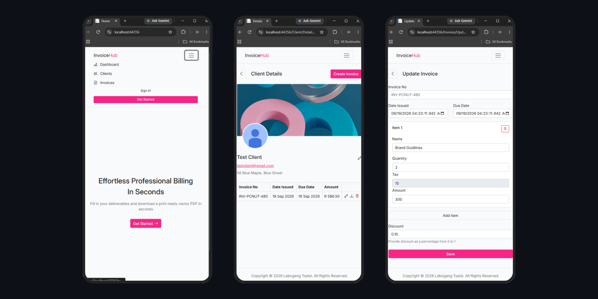

# InvoiceHub

> A FullStack Invoice & Client Management System built with ASP.NET
> Core MVC, designed with a SaaS style approach for businesses and freelancers.

InvoiceHub helps businesses and independent professionals manage
clients, create invoices, calculate invoice's dynamically, and
generate professional PDF invoices from a centralized web application.

The project was built as a practical FullStack application to
demonstrate Authentication, Authorization, Onion Architecture,
Database Integration, Business Logic, PDF generation, CRUD operations,
and an Administrative Dashboard.

https://invoicehub-nl4s.onrender.com/

## Features

- User authentication & authorization
- Role-based access
- Client management
- Invoice management
- Dynamic invoice calculations
- Tax & discount support
- PDF invoice generation
- Admin dashboard
- Revenue overview

## Tech Stack

- C# and .NET
- JavaScript
- ASP.NET Core
- Entity Framework Core
- Supabase - PostgrestSql

## Architecture

The application uses a Onion architecture:

- `IMS` — MVC application
- `IMS_DomainLayer` — Domain models
- `IMS_RepositoryLayer` — Data access
- `IMS_ServiceLayer` — Business logic
- `IMS_InfrastructureLayer` — Infrastructure

## Admin Access

Administrator dashboard credentials are available upon request.

**Contact:** ltsatsi18@gmail.com

## Author

**Lebogang Tsatsi**

Built as a FullStack portfolio project demonstrating ASP.NET Core, authentication, database integration, business logic, PDF generation, and SaaS-style application development.
